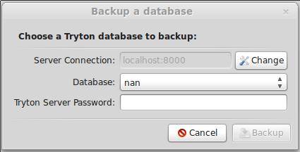
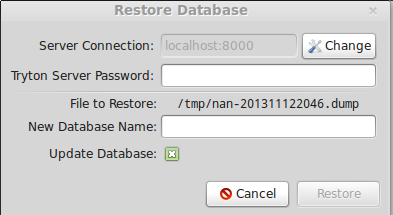

Database management
===================

Install a database of your choice. Here Posgres database is taken as sample
database. Steps for installing Postgres can be found from
`Postgres Installation <http://wiki.postgresql.org/wiki/Detailed_installation_guides/>`_
Install the database and give a new password to the postgres database
user.

Creating Database
-----------------
TODO

Upgrading a Database
--------------------
To upgrade the database there are 2 ways to do that:

* By typing the command:

.. code-block:: bash

    $ trytond -c ../etc/trytond.conf -u module_name -d database_name

* By using tryton client and connecting with your database.
    On left bar Under Modules > Modules.
    There you will see the modules installed on your tryton client along with
    the modules that are not in installed state. You can simply click on Mark
    for Installation for the module you wish to install and then click on
    Launch action to Perform Pending Installation/Upgrade. All the modules
    that you mark for installation will be installed.

Installing Modules
------------------

Each tryton database can be customized depending on the modules that are
installed on it. A module is set of files that adds new functionalities to a
tryton database.

A module can do one (or more) of the following things:

* Create new models
* Create new fields on existing models
* Create new views
* Modify existing views

To install a new module you can go to the `Administration/Modules` menú which
contains a list of all the available modules on the server. To install a new
module, you can push the *Mark for install* button. When you have finished
selecting all the modules you want to install, you must use the `Action` button
on the toolbar to launch the *Perform Pending Installation/Upgrade* wizard.

Once the wizard is finished, the new modules should be available on your
database.

.. warning:: Some modules add new groups, so in order to see their options you
            will have to modifiy your user to add it to the newly added groups.

Uninstalling Modules
--------------------

Although tryton has the option to uninstall a module on a database,
occasionally it might not work as expected, as is still in the beta status.
We recomend you to avoid uninstalling modules as much as possible.

If you want to test a module, you can install it on a test database and then
install it on the production database if that module fits your needs. If
you need some data to test your module you can create a copy of your production
database and restore it with a diferent name.

Backup & Restore
-----------------

The Tryton client allows you to create and restore backup of your databases.

To backup/restore databases, you will need the `admin_passwd` that was
configured on your server. The default value for this password is `admin`.

Backup a database
~~~~~~~~~~~~~~~~~

Open your Tryton client and go to `File/Databases/Backup Database`. You will
see a screen, which will display the following details:

   Tryton's client backup option

Once you have selected one database from your Tryton server and entered the
admin password the backup will be triggered. When the backup finishes, you will
be asked to select a folder to save the backup.

All the backups generated with the client can also be restored by the client.

Restore a database
~~~~~~~~~~~~~~~~~~

To restore a backup generated with the tryton client you must open your Tryton
client and go to `File/Databases/Restore Database`. You will be prometed to
entenr the name of the backup file you want to restore. Once the name is
entered,  you will see a screen which displays the following details:

   Tryton's client restored option

You must enter your server password and the database name to the new restored
database.

If you don't want to upgrade the database after restoring you must unselect the
`Update Database` option. We encourage you to keep this option selected as it
is always a good idea to update your database after restoring.

