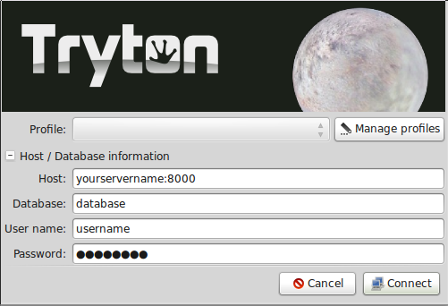
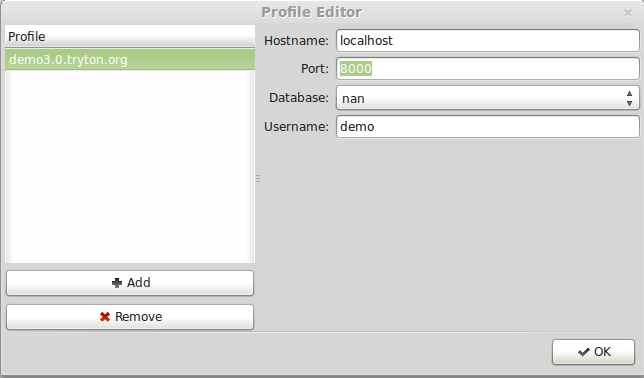
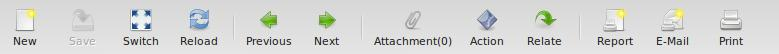
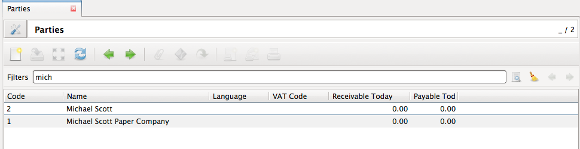
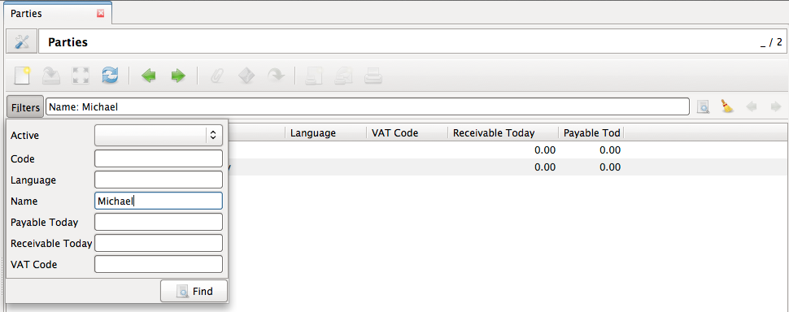
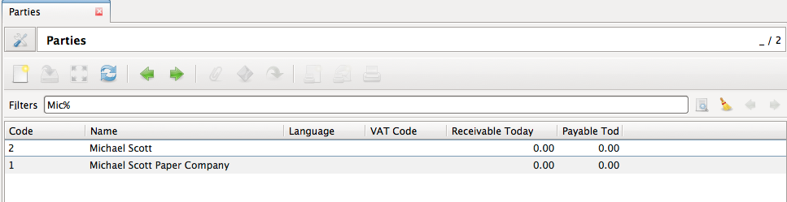
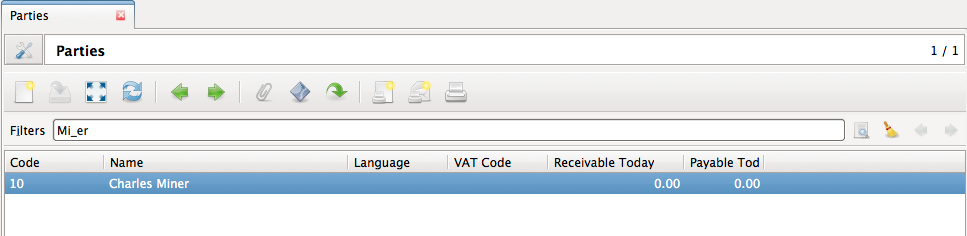
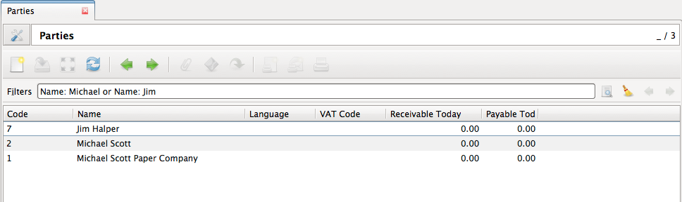

Using the Tryton Desktop Client
===============================

Tryton is a desktop client application, which means we need to know the
server url and the port to connect to it. We also need to know the database
that we are going to work on. There is also the possibility of creating a
new database if needed.

Getting the Tryton Desktop Client
---------------------------------

The desktop client can be downloaded from the `downloads page
<http://www.tryton.org/download.html>`_ of the Tryton website.

.. warning:: To be able to connect to a server you must use a client version
             of the same series as server. So if your server is series 3.0
             you must use 3.0 series client.

Connecting to your server
-------------------------

The first time you open the Tryton client you will see the following screen.



   Tryton's client login window

In this window you can enter the connection parameters of your server:

* *yourserver*: It's your server URL. Something like demo.tryton.org
* *port*: It's the port where your server is running. The default value is 8000
* *database*: It's the name of the database you will work on.
* *user*: Introduce the username you want to use for connecting.
* *password*: Introduce your password to connect to the server.

Managing profiles
~~~~~~~~~~~~~~~~~

The Tryton client has the ability of managing connection profiles, so you only
have to introduce the details of the server only one time. If you click the
`Manage Profiles` button you will see the following screen:



   Tryton connection profiles.


In the left part of the screen, you will see all the available profiles. You can
add a new one by using the `Add` button. You can also delete old profiles with
the `Remove` button. Use the right part of the screen to modify current
profiles or to add the details of new created profiles.

The client will try to connect to the server to load the databases. It will
fail if you can't connect to the server.

You can open the Tryton client numerous times. This is useful
when you need to access diferent servers or databases at the same time.

Password window
~~~~~~~~~~~~~~~

For security reasons the client will ask you to enter your password, if your
screen has been inactive for some time.

Client options
--------------

You can customize the behaviour of your client by selecting the options menu.
The most common options are:

* Toolbar: Used to change the toolbar view. You can select to show only icons,
  only text and text and icons. The default value will show only icons.
* Form: Used to change the view of the Tryton client. The following options
 are available:
    * Save Width/Height: If marked, the client will remember the width of the
      columns if you modify it.
    * Save Tree Status: If marked, the client will remember the opened nodes in
      tree view.
    * Tabs positions: You can define where the forms tabs are shown. Possible
      values are: Top, Left, Right, Bottom.
* Search Limit: Used to change the number of records the client will search
  for. The default value is 1000.
* Email: You can introduce the command that will be executed when you use the
  send report by email option.

Toolbar options
---------------

In every Tryton tab the following toolbar option is available.


You can change toolbar view, just go to "option" on the top of the screen
and select the toolbar options and select one from the following:

* Default
* Text and icons
* Icons
* Text

Text and icon view can be seen below:




Toolbar icons

They are distributed in four groups:

* Edition: Used to edit records.
* Navigation: Used to navigate through the records.
* Action: Used to interact with the records.
* Report: Used to generate reports.

In the *Edition* group the following icons are available (in order):

* New: Used to create a new record.
* Save: Used to save changes in the current record. If you haven't
  changed the current record it will be disabled.
* Switch: Used to switch the current view of the data.
* Reload: Used to refresh the data.

In the *Navigation* group the following icons are available (in order):

* Previous: Go to previous record.
* Next: Go to next record.

In the *Action* group the following icons are available (in order):

* Attachment: Used to show attachments of the records.
* Action: Used to perform some action on the selected records.
* Relate: Used to navigate to relate info of the record. For instance, if you're
  on a Party record you can use this button to show all the invoices related
  to this party.

In the *Report* group the following icons are available (in order):

* Report: Generate a report and show it on the screen.
* Email: Will generate a report and open your email client to send it.
* Print: Print a report directly on a printer.

Searching
---------

A query is composed to search clauses. A clause is composed of a field name
(with : at the end), an operator and a value. The field name is optional and
defaults to the record name. The operator is also optional and defaults to
a case insensitive search on the name of the record.

Examples:

mich




Name: Michael





Operators
``````````

The following operators can be used:

 * =: equal to
 * <: less then
 * <=: less then or equal to
 * >: greater then
 * >=: greater then or equal to
 * !=: not equal
 * !: not equal or not like (depending of the type of field)

For example: Name: != Dwight


Wildcards
`````````

There are two wildcards:

%: matches any string of zero or more characters
~~~~~~~~~~~~~~~~~~~~~~~~~~~~~~~~~~~~~~~~~~~~~~~~~



'_': matches any single character
~~~~~~~~~~~~~~~~~~~~~~~~~~~~~~~~~~



It is possible to escape special characters in values by using double quotes.
For example: Name: "Michael:Scott"
Here it will search with the value Michael:Scott.


Clause composition
``````````````````

The clauses can be composed using the two boolean operators `and` and `or`.
By default, there is an implicit `and` between each clause if no operator is
specified.

For example::

    Name: Michael Amount: 100

is the same as::

    Name: Michael and Amount: 100


Example using `or`
~~~~~~~~~~~~~~~~~~




The `and` operator has a highest precedence than "or" but you can change
it by using parenthesis.

For example::

    (Name: Michael or Name: Pam) and Amount: 100

is different than::

    Name: Michael or Name: Pam and Amount: 100

which is evaluated as::

    Name: Michael or (Name: Pam and Amount: 100)

Tips and Tricks
---------------

* *Refresh button*: If you want to discard your changes on a record you can use
  the refresh button to reload server values.
* *Favorites*: You can save you favorites menu options by clicking on their
  star. Your favorites will be shown in the `Favorites` menu of the client.
* *Global search*: The text box in the top of the menu option is used to
  perform a text search on all global search enabled models. You can also
  access the global search by typing Ctrl+K from any place of the Tryton client
* Saving searches
* Hide the menu
* Right clicking on tree view


Attachments
-----------

On Tryton you can add attachments to any record. You can use the clip icon to
attach some documents in a record.

The clip icon will show you yellow mark if the record has attachments.
